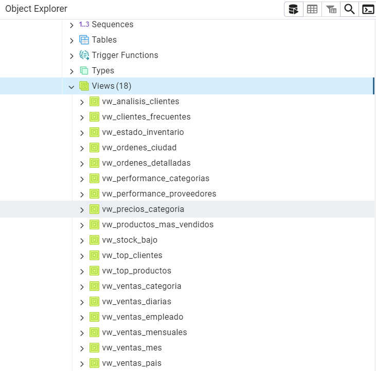

# 📦 Base de Datos Northwind (Adaptada para PostgreSQL) 
Este proyecto incluye una versión adaptada del conocido conjunto de datos Northwind, especialmente preparada para funcionar con PostgreSQL. Se trata de una base de datos que simula el funcionamiento de una empresa distribuidora de alimentos, con información detallada sobre clientes, productos, pedidos, empleados, envíos y otros aspectos clave del negocio.
# ✨ Funcionalidades Añadidas
Organización Jerárquica de Categorías: Se incorporaron subcategorías para lograr una estructura más ordenada y fácil de navegar.

# 🛠️ Tecnologías Utilizadas
PostgreSQL 12 o superior como sistema de gestión de bases de datos
pgAdmin  para administración y visualización
Archivo SQL Dump incluido para facilitar una instalación rápida
# 📁 Estructura del Repositorio
``` bash
northwind-postgres-modificado/
├── README.md — Información general
├── northwind_modificado.sql — ⭐ Dump completo de la BD
├── docs/ — Guías de instalación, mejoras y ejemplos
└── img/ — Diagrama ER y capturas de consultas
```
# 🚀 Instalación Rápida
Requisitos Previos:
PostgreSQL 12+
Cliente psql o pgAdmin 
# 🕥 Instalación en 3 pasos
1. clonar repositorio
``` bash
 git clone https://github.com/tu-usuario/northwind-postgres-modificado.git
cd northwind-postgres-modificado
```
2. crear base de datos
``` bash
 createdb northwind_curso
```
3. Restaurar dump completo
``` bash
psql -d northwind_curso -f northwind_modificado.sql
```
¡Y listo! La base de datos estará completamente configurada con datos de ejemplo.
# 📊 Vistas SQL del Proyecto Northwind (PostgreSQL)

# ✅ Verificar vistas en PostgreSQL
``` bash
SELECT * FROM vw_productos_stock LIMIT 5;
SELECT * FROM vw_clientes_frecuentes LIMIT 5;
SELECT * FROM vw_empleados_ventas LIMIT 5;
SELECT * FROM vw_total_ventas_por_pais LIMIT 5;
SELECT * FROM vw_top_productos LIMIT 5;
SELECT * FROM vw_envios_pendientes LIMIT 5;
```
   
# 🚀 Instalación de la Base de Datos Northwind_curso en PostgreSQL desde la Terminal
``` bash
C:\Users\ademo>psql -U postgres -d postgres
Contraseña para usuario postgres:

psql (17.4)
ADVERTENCIA: El código de página de la consola (850) difiere del código
            de página de Windows (1252).
            Los caracteres de 8 bits pueden funcionar incorrectamente.
            Vea la página de referencia de psql «Notes for Windows users»
            para obtener más detalles.
Digite «help» para obtener ayuda.

postgres=# createdb northwind_curso
postgres-# psql -d northwind_curso -f northwind_modificado.sql
postgres-# \q

C:\Users\ademo>createdb -U postgres northwind_curso
Contraseña:
```
# 📌 Realizar una copia de seguridad completa (dump) de la base de datos Northwind y almacenarla en un archivo.
``` bash
pg_dump -U postgres -d northwind -f "C:\Users\ademo\Desktop\git\SQL-POSTGRES-Northwind.sql"
```


